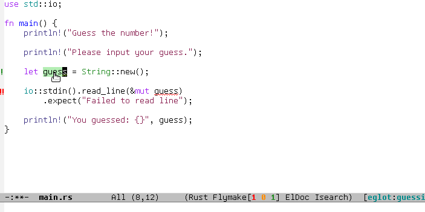
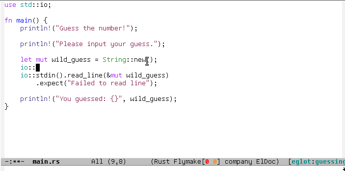
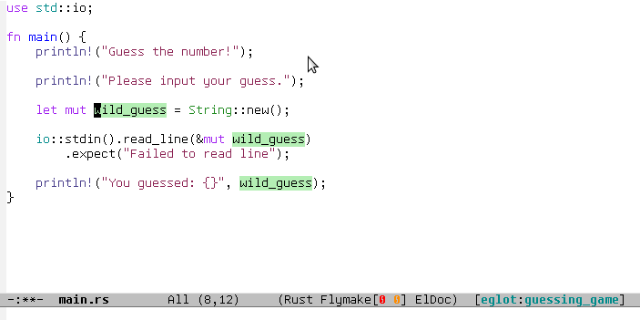
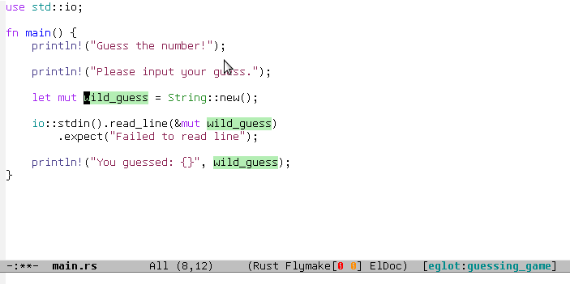
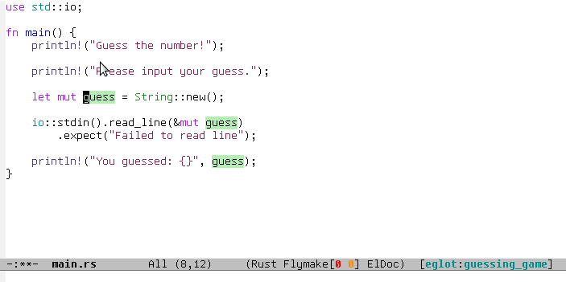
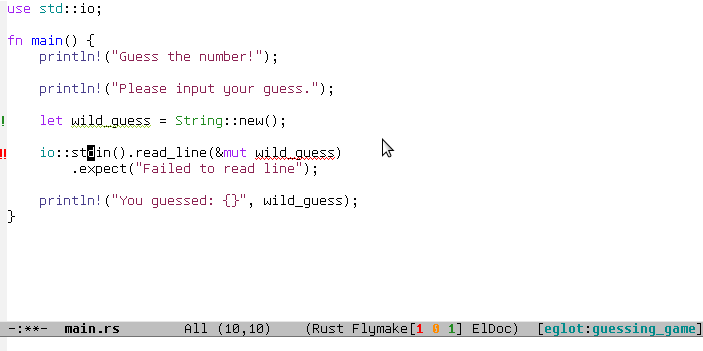
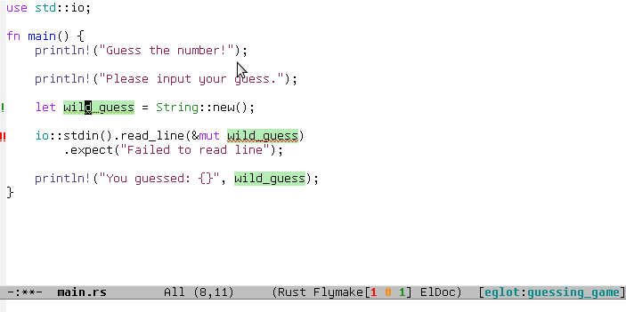

[](https://travis-ci.org/joaotavora/eglot)
[](http://melpa.org/#/eglot)

Eglot
-----

*E*macs Poly*glot*. Emacs client to [Language Server Protocol][lsp]
servers.  Scroll down this README for some
[pretty gifs](#animated_gifs).

# Installation and usage

Eglot is in both [ELPA][gnuelpa] and [MELPA][melpa]. Installation is
straightforward:

```
(package-install 'eglot) ; Requires Emacs 26!
;; Now find some source file, any source file
M-x eglot
```

*That's it*. If you're lucky, this guesses the LSP executable to start
for the language of your choice. Otherwise, it prompts you to enter one:

`M-x eglot` can guess and work out-of-the-box with these servers:

* Javascript's [javascript-typescript-stdio][javascript-typescript-langserver]
* Rust's [rls][rls]
* Python's [pyls][pyls]
* Ruby's [solargraph][solargraph]
* Bash's [bash-language-server][bash-language-server]
* PHP's [php-language-server][php-language-server]
* C/C++'s [cquery][cquery]
* Haskell's [IDE engine][haskell-ide-engine]

I'll add to this list as I test more servers. In the meantime you can
customize `eglot-server-programs`:

```lisp
(add-to-list 'eglot-server-programs '(foo-mode . ("foo-language-server" "--args")))
```

Let me know how well it works and we can add it to the list.  You can
also enter a `server:port` pattern to connect to an LSP server. To
skip the guess and always be prompted use `C-u M-x eglot`.

## Connecting automatically

You can also do:

```lisp
  (add-hook 'foo-mode-hook 'eglot-ensure)
```

, to attempt to start an eglot session automatically everytime a
`foo-mode` buffer is visited.

## Connecting via TCP

The examples above use a "pipe" to talk to the server, which works
fine on Linux and OSX but in some cases
[*may not work on Windows*][windows-subprocess-hang].

To circumvent this limitation, or if the server doesn't like pipes,
you can use `C-u M-x eglot` and give it `server:port` pattern to
connect to a previously started TCP server serving LSP information.

If you don't want to start it manually every time, you can configure
Eglot to start it and immediately connect to it.  Ruby's
[solargraph][solargraph] server already works this way out-of-the-box.

For another example, suppose you also wanted start Python's `pyls`
this way:

```lisp
(add-to-list 'eglot-server-programs
             `(python-mode . ("pyls" "-v" "--tcp" "--host"
                              "localhost" "--port" :autoport))))
```

You can see that the element associated with `python-mode` is now a
more complicated invocation of the `pyls` program, which requests that
it be started as a server.  Notice the `:autoport` symbol in there: it
is replaced dynamically by a local port believed to be vacant, so that
the ensuing TCP connection finds a listening server.

# Commands and keybindings

Here's a summary of available commands:

- `M-x eglot`, as described above;

- `M-x eglot-reconnect` reconnects to the server;

- `M-x eglot-shutdown` says bye-bye to the server;

- `M-x eglot-rename` ask the server to rename the symbol at point;

- `M-x eglot-format` asks the server to format buffer or the active
  region;

- `M-x eglot-code-actions` asks the server for any code actions at
  point. These may tipically be simple fixes, like deleting an unused
  variable, or fixing an import. Left click on diagnostics to check if
  there are any there;

- `M-x eglot-help-at-point` asks the server for help for symbol at
  point. Currently this is what `eldoc-mode` displays in the echo
  area;

- `M-x eglot-events-buffer` jumps to the events buffer for debugging
  communication with the server.

- `M-x eglot-stderr-buffer` if the LSP server is printing useful debug
information in stderr, jumps to a buffer with these contents.

- `M-x eglot-signal-didChangeConfiguration` updates the LSP server
configuration according to the value of the variable
`eglot-workspace-configuration`, which you may, for example set in a
`.dir-locals` file.`

There are *no keybindings* specific to Eglot, but you can bind stuff
in `eglot-mode-map`, which is active as long as Eglot is managing a
file in your project. The commands don't need to be Eglot-specific,
either:

```
(define-key eglot-mode-map (kbd "C-c h") 'eglot-help-at-point)
(define-key eglot-mode-map (kbd "<f6>") 'xref-find-definitions)
```

# How does this work exactly?

`M-x eglot` starts a server via a shell-command guessed from
`eglot-server-programs`, using the current major-mode (for whatever
language you're programming in) as a hint.

If the connection is successful, you see an `[eglot:<server>]`
indicator pop up in your mode-line.  More importantly, this means
current *and future* file buffers of that major mode *inside your
current project* automatically become \"managed\" by the LSP server,
i.e.  information about their contents is exchanged periodically to
provide enhanced code analysis via `xref-find-definitions`,
`flymake-mode`, `eldoc-mode`, `completion-at-point`, among others.

To "unmanage" these buffers, shutdown the server with `M-x
eglot-shutdown`.

# Supported Protocol features (3.6)

## General
- [x] initialize
- [x] initalized
- [x] shutdown
- [x] exit
- [ ] $/cancelRequest

## Window
- [x] window/showMessage
- [x] window/showMessageRequest
- [x] window/logMessage
- [x] telemetry/event

## Client
- [x] client/registerCapability (but only
  `workspace/didChangeWatchedFiles`, like RLS asks)
- [x] client/unregisterCapability  (ditto)

## Workspace
- [x] workspace/workspaceFolders (3.6.0, partial)
- [ ] workspace/didChangeWorkspaceFolders (3.6.0)
- [x] workspace/didChangeConfiguration
- [ ] workspace/configuration (3.6.0)
- [x] workspace/didChangeWatchedFiles
- [x] workspace/symbol
- [x] workspace/executeCommand
- [x] workspace/applyEdit

## Text Synchronization
- [x] textDocument/didOpen
- [x] textDocument/didChange (incremental or full)
- [x] textDocument/willSave
- [x] textDocument/willSaveWaitUntil
- [x] textDocument/didSave
- [x] textDocument/didClose

## Diagnostics
- [x] textDocument/publishDiagnostics

## Language features
- [x] textDocument/completion
- [x] completionItem/resolve (works quite well with [company-mode][company-mode])
- [x] textDocument/hover
- [x] textDocument/signatureHelp (fancy stuff with Python's [pyls][pyls])
- [x] textDocument/definition
- [ ] textDocument/typeDefinition (3.6.0)
- [ ] textDocument/implementation (3.6.0)
- [x] textDocument/references
- [x] textDocument/documentHighlight
- [x] textDocument/documentSymbol
- [x] textDocument/codeAction
- [ ] textDocument/codeLens
- [ ] codeLens/resolve
- [ ] textDocument/documentLink
- [ ] documentLink/resolve
- [ ] textDocument/documentColor
- [ ] textDocument/colorPresentation (3.6.0)
- [x] textDocument/formatting 
- [x] textDocument/rangeFormatting
- [ ] textDocument/onTypeFormatting
- [x] textDocument/rename

<a name="animated_gifs"></a>
# _Obligatory animated gif section_









# Differences to lsp-mode.el

Eglot is **beta**. It may currently underperform
[lsp-mode.el][emacs-lsp], both in functionality and correctness. That
other extension is much more mature and has a host of
[plugins][emacs-lsp-plugins] for bells and whistles.  If you don't
like the minimalist approach of `eglot.el`, you could be better served
with `lsp-mode.el` for now.

User-visible differences:

- Single and friendly entry point `M-x eglot`, not `M-x
  eglot-<language>`. Also no `eglot-<language>` extra packages.
- No "whitelisting" or "blacklisting" directories to languages. `M-x
  eglot` starts servers to handle major modes inside a specific
  project. Uses Emacs's built-in `project.el` library to discover
  projects. Automatically detects current and future opened files
  under that project and syncs with server.
- Easy way to quit/restart a server, just middle/right click on the
  connection name.
- Pretty interactive mode-line section for live tracking of server
  communication.
- Automatically restarts frequently crashing servers (like RLS).
- Server-initiated edits are confirmed with the user.
- Diagnostics work out-of-the-box (no `flycheck.el` needed).
- Smoother/more responsive (read below).
   
Under the hood:

- Message parser is much simpler.
- Defers signature requests like `textDocument/hover` until server is
  ready.
- Sends `textDocument/didChange` for groups of edits, not
  one per each tiny change.
- Easier to read and maintain elisp. Yeah I know, *very subjective*,
  so judge for yourself.
- Doesn't *require* anything other than Emacs, but will automatically
  upgrade to work with stuff outside Emacs, like `company`,
  `markdown-mode`, if you happen to have these installed.
- Has automated tests that check against actual LSP servers.

[lsp]: https://microsoft.github.io/language-server-protocol/
[rls]: https://github.com/rust-lang-nursery/rls
[pyls]: https://github.com/palantir/python-language-server
[gnuelpa]: https://elpa.gnu.org/packages/eglot.html
[melpa]: http://melpa.org/#/eglot
[javascript-typescript-langserver]: https://github.com/sourcegraph/javascript-typescript-langserver
[emacs-lsp]: https://github.com/emacs-lsp/lsp-mode
[emacs-lsp-plugins]: https://github.com/emacs-lsp
[bash-language-server]: https://github.com/mads-hartmann/bash-language-server
[php-language-server]: https://github.com/felixfbecker/php-language-server
[company-mode]: https://github.com/company-mode/company-mode
[cquery]: https://github.com/cquery-project/cquery
[solargraph]: https://github.com/castwide/solargraph
[windows-subprocess-hang]: https://www.gnu.org/software/emacs/manual/html_node/efaq-w32/Subprocess-hang.html
[haskell-ide-engine]: https://github.com/haskell/haskell-ide-engine

